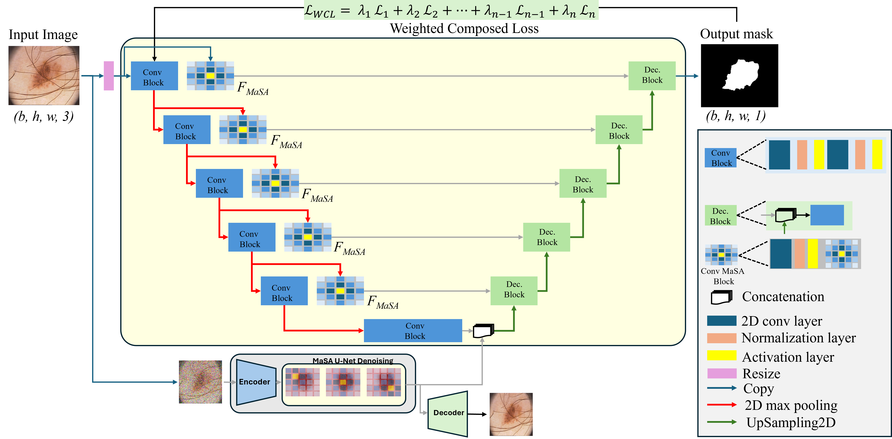

# MaSA_UNet
We introduce the MaSA-UNet, a U-Net-like architecture complemented by the Manhattan Self-Attention mechanism for biomedical image segmentation. 

  <figure>
    
    <figcaption>Detailed illustration of the proposed MaSA-UNet model. The picture depicts the key components of the architecture, the pre-trained MaSA denoised model, the MaSA segmentation model, and the WCL function.</figcaption>
  </figure>

